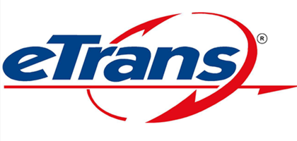

# E-Trans Dashboard



**E-Trans** is a full-stack logistics management system built with **Vue 3**, **Java 17 Spring Boot**, and **PostgreSQL**. It provides administrators and company users a modern, responsive dashboard to manage customers, vehicles, routes, materials, invoices, and reports.

---

## 🚀 Features

- Role-Based Access Control (Admin / Company User)
- Dynamic Sidebar with Active Link Highlighting
- Customer, Material, Vehicle, and Route Management
- Outward Shipments & Invoicing
- Reports & GSTR1 (Admin Only)
- Credit Notes & Company Management (Admin Only)
- Global Toast Notifications for Feedback

---

## 🏗️ Tech Stack

| Layer        | Technology |
|-------------|------------|
| Frontend    | Vue 3, Vue Router, Pinia, Bootstrap Icons |
| Backend     | Java 17, Spring Boot 3, Spring Security, Spring Data JPA |
| Database    | PostgreSQL |
| Build Tools | Node.js, Vite, Maven/Gradle |

---

## 📐 Architecture

```mermaid
graph TD
    A[Vue 3 Frontend] -->|REST API| B[Spring Boot Backend]
    B -->|JPA/Hibernate| C[PostgreSQL Database]
````

---

## 📄 Documentation

All documentation is available in the [`docs`](docs/) folder and accessible via **GitHub Pages**.

| Page                                 | Description                                                             |
| ------------------------------------ | ----------------------------------------------------------------------- |
| [Installation](docs/installation.md) | Step-by-step setup for backend, frontend, and database                  |
| [Usage](docs/usage.md)               | Guide to navigating the dashboard, login/signup, and role-based modules |
| [API Reference](docs/api.md)         | All backend REST API endpoints with request/response examples           |

---

## 💻 Screenshots

### Dashboard


### Customer Management


### Vehicle Management


---

## 📌 Quick Start

1. Clone the repository:

```bash
git clone https://github.com/yourusername/e-trans-dashboard.git
cd e-trans-dashboard
```

2. Start the backend (Spring Boot + PostgreSQL):

```bash
cd backend
./mvnw spring-boot:run
```

3. Start the frontend (Vue 3):

```bash
cd frontend
npm install
npm run dev
```

4. Open your browser: `http://localhost:5173`

---

## 🔑 Authentication

* **Admin:** Access all modules, reports, and GSTR1
* **Company User:** Access operational modules (customers, vehicles, routes, invoices)
* **Pinia Auth Store:** Handles login, signup, logout, token storage, and role-based access

```javascript
const authStore = useAuthStore()
await authStore.login('username', 'password')
authStore.clearAuth() // Logout
```

---

## 📁 Repository Structure

```text
e-trans-dashboard/
├── backend/        # Spring Boot backend
├── frontend/       # Vue 3 frontend
├── docs/           # Documentation (Installation, Usage, API)
├── README.md
└── LICENSE
```

---

## ⚡ License

This project is licensed under the MIT License.

---

## 📌 GitHub Pages

* Enable GitHub Pages with the `docs/` folder as the source.
* Your documentation will be available at:

```
https://yourusername.github.io/e-trans-dashboard/
```

---

This README.md **links all docs pages, shows architecture, tech stack, and screenshots**, just like professional GitHub portfolios such as [pratikdimble/eaas-app-doc].([https://pratikdimble.github.io/e-trans-doc]).
