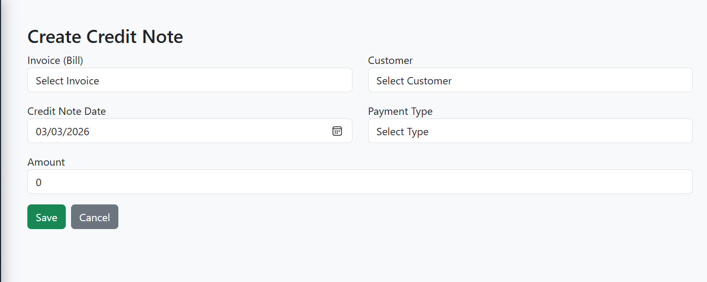

# Credit Note Module

The **Credit Note Module** in **E-Trans Dashboard** is used to **create, update, and manage credit notes** for invoices (bills).  
It ensures proper validation against invoice balances and maintains accurate customer accounting.

---

## 🔹 Features

- Create or update a credit note
- Select **Invoice (Bill)** and auto-populate **Customer**
- Lock customer selection if credit note is pre-associated
- Auto-fill credit note amount based on invoice balance
- Validate credit note amount against invoice balance:
  - Amount cannot exceed invoice balance
  - Amount must be greater than zero
  - Adjustments allowed in edit mode
- Select **Payment Type**: Cash, Cheque, Online
- Toast notifications for success, warnings, and errors

---

## 🖥️ Form Fields

| Field                     | Type           | Description |
|----------------------------|----------------|-------------|
| Invoice (Bill)            | Dropdown       | Select invoice; shows balance for reference |
| Customer                  | Dropdown       | Auto-filled based on invoice; can be locked |
| Credit Note Date          | Date           | Defaults to today |
| Payment Type              | Dropdown       | Cash / Cheque / Online |
| Amount                    | Number         | Max: Invoice Balance; validated on input |

---

## 🔗 API Endpoints

| Action                  | Method | Endpoint                        | Description |
|-------------------------|--------|---------------------------------|-------------|
| Add Credit Note         | POST   | `/credit-notes`                 | Create a new credit note |
| Update Credit Note      | PUT    | `/credit-notes/{id}`            | Update an existing credit note |
| Get Credit Note         | GET    | `/credit-notes/{id}`            | Fetch credit note details |
| Invoice (Bill) List     | GET    | `/bill?page=0&size=1000`       | List of invoices for selection |

---

## 📝 Workflow

1. Navigate to **Credit Notes** in the dashboard.  
2. Click **Add Credit Note** or **Edit Credit Note**.  
3. Fill in required fields:
   - Select **Invoice (Bill)**; Customer is auto-filled
   - Select **Credit Note Date**
   - Select **Payment Type**
   - Enter **Amount** (validated against invoice balance)
4. Click **Save** or **Update**.  
5. Toast notifications indicate success or error.  
6. User is redirected to the **Credit Notes List** on success.

---

## ⚡ Validation Logic

- **Amount must be > 0**
- **Amount cannot exceed Invoice balance**
- **Edit Mode:**  
  - Adjustment allowed: New amount ≤ Invoice Balance + Old Credit Note Amount
- Customer field is **locked** if credit note is pre-associated with invoice
- Invoice selection updates customer and max allowed amount automatically

## 📷 Screenshot (Example)

