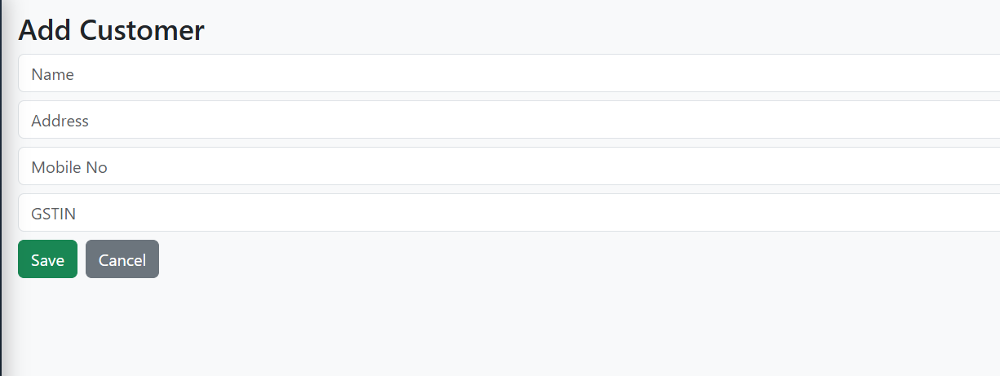

# Customer Module

The **Customer Module** in **E-Trans Dashboard** allows users to **add, update, and manage customer information**. This module ensures accurate records for customers associated with the companies on the platform.

---

## 🔹 Features

- Add new customers
- Edit existing customer details
- Mobile number validation (Indian 10-digit format)
- GSTIN validation
- Real-time toast notifications for success, warning, or error
- Automatic redirection after save/update

---

## 🖥️ Form Fields

| Field       | Type   | Description |
|------------|--------|-------------|
| Name       | Text   | Customer name (Required) |
| Address    | Text   | Full address of the customer (Required) |
| Mobile No  | Text   | Indian mobile number, 10 digits starting with 6-9 (Required) |
| GSTIN      | Text   | GST Identification Number (Required) |

---

## ⚡ Validations

### Mobile Number

- Must be **10 digits**
- Must start with **6,7,8, or 9**
- Regex: `^[6-9]\d{9}$`

### GSTIN

- Must follow the Indian GSTIN format  
- Regex: `^[0-9]{2}[A-Z]{5}[0-9]{4}[A-Z]{1}[1-9A-Z]{1}Z[0-9A-Z]{1}$`

---

## 📝 Example Usage (Vue 3 + Pinia)

```javascript
import { ref } from 'vue'
import apiClient from '@/axios'

const customer = ref({
  name: 'John Doe',
  address: '456, Industrial Road, Pune',
  mobileNo: '9876543210',
  gstin: '27ABCDE1234F2Z5'
})

const saveCustomer = async () => {
  try {
    await apiClient.post('/customer', customer.value)
    console.log('Customer added successfully')
  } catch (error) {
    console.error('Error saving customer', error)
  }
}
````

---

## 🔗 API Endpoints

| Action          | Method | Endpoint         | Description                       |
| --------------- | ------ | ---------------- | --------------------------------- |
| Add Customer    | POST   | `/customer`      | Add a new customer                |
| Update Customer | PUT    | `/customer/{id}` | Update an existing customer       |
| Get Customer    | GET    | `/customer/{id}` | Fetch a single customer’s details |
| List Customers  | GET    | `/customer`      | Fetch all customers               |

---

## ✅ Workflow

1. Navigate to **Customers** from the sidebar.
2. Click **Add Customer** or **Edit** an existing customer.
3. Fill in all required fields.
4. Validation will prevent invalid Mobile Numbers or GSTIN.
5. Click **Save** or **Update**.
6. Toast notifications will appear:

   * ✅ Success
   * ⚠ Warning (e.g., duplicate customer)
   * ❌ Error (validation failure or server error)
7. On success, the page redirects to **Customer List**.

---

## 📷 Screenshot (Example)


---

This file should go into your `docs/` folder and can be linked in `_sidebar.md` like:

```markdown
* [Company Module](company.md)
* [Customer Module](customer.md)
````
